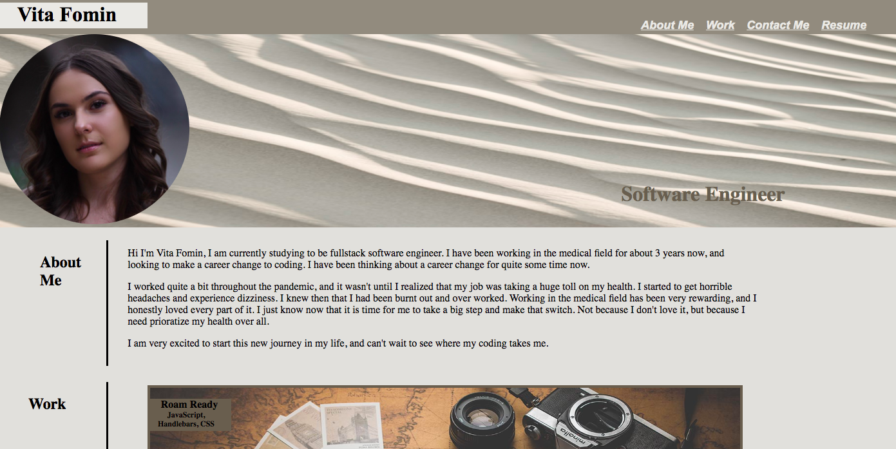

# challenge-20-react-portfolio

## Description

 In this weeks challenge I was tasked to complete my protfolio using react. When the application loads the user is presented with a page that contains the the header, main section, and the contact components. The header is presented with the navigational links and a profile picture. When the links are click the user is taken to that corresponding section. The portfolio presents the user with 5 applications and each of the apps have links, allowing the user to be taken to the deployed site. The final thing that the user is presented with is the contact component. The contact section presents the phone number, gitub, and the email address for the user to get in contact with me!

## Installation

For this application to work you need to to make sure react is installed along with react-dom, react scripts. If you run the command "npx create-react-app" everything you need will be provided for you.  

## Usage

This is a great tool for anyone that is trying to build a portfolio. This is a great way to present to future employers all the work that you have done, and are proud of. 

https://vitafomin.github.io/challenge-20-react-portfolio/

## Credits

N/A

## License

Please refer to the LICENSE in the repo